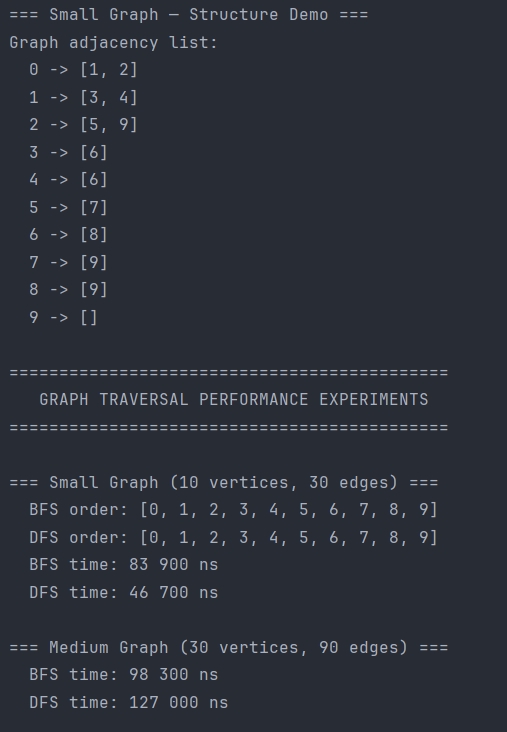
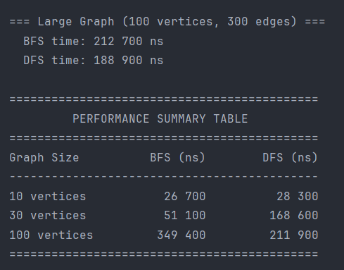

# Assignment 4: Graph Traversal and Representation System

## A. Project Overview

This project implements a **Graph** data structure and two classic traversal algorithms — **Breadth-First Search (BFS)** and **Depth-First Search (DFS)** — in Java.

A **graph** is a collection of **vertices** (nodes) connected by **edges** (links). Graphs model many real-world systems: social networks, road maps, web pages, and dependency trees.

- A **vertex** is an entity (a person, a city, a page).
- An **edge** is a relationship between two vertices (a friendship, a road, a hyperlink).
- This implementation uses **directed edges** — an edge from A to B does not automatically create an edge from B to A.

**BFS** explores the graph level by level, visiting all immediate neighbors before going deeper. **DFS** dives as deep as possible along each path before backtracking.

---

## B. Class Descriptions

### `Vertex`
Represents a single node in the graph. Stores a unique integer `id` and provides a `toString()` method for readable output.

### `Edge`
Represents a directed connection between two vertices (`source → destination`). Stores references to both `Vertex` objects.

### `Graph`
The core data structure. Uses an **adjacency list** — a `HashMap<Integer, List<Integer>>` — to map each vertex id to its list of neighbors.

**Why adjacency list?**
- Space-efficient: stores only existing edges — O(V + E) instead of O(V²).
- Fast neighbor lookup: iterating neighbors is proportional to the degree of the vertex.
- Ideal for sparse graphs (most real-world graphs are sparse).

**Methods:**
- `addVertex(Vertex v)` — registers a new vertex.
- `addEdge(int from, int to)` — adds a directed edge.
- `printGraph()` — prints the full adjacency list.
- `bfs(int start)` — BFS traversal, returns visit order.
- `dfs(int start)` — DFS traversal, returns visit order.

### `Experiment`
Builds graphs of sizes 10, 30, and 100 vertices, runs traversals, measures execution time with `System.nanoTime()`, and prints a formatted comparison table.

---

## C. Algorithm Descriptions

### Breadth-First Search (BFS)

**Step-by-step:**
1. Enqueue the starting vertex; mark it visited.
2. Dequeue the front vertex; record it.
3. For each unvisited neighbor: mark visited, enqueue.
4. Repeat until the queue is empty.

**Data structure:** Queue (FIFO)

**Use cases:**
- Finding the shortest path in an unweighted graph.
- Level-order traversal.
- Web crawlers, social network friend recommendations.

**Time complexity:** O(V + E) — every vertex and every edge is processed at most once.

---

### Depth-First Search (DFS)

**Step-by-step:**
1. Push the starting vertex onto a stack.
2. Pop the top vertex; if not visited, record it and mark visited.
3. Push all unvisited neighbors (in reverse order to preserve direction).
4. Repeat until the stack is empty.

**Data structure:** Stack (LIFO) — iterative implementation to avoid stack overflow.

**Use cases:**
- Cycle detection.
- Topological sorting.
- Maze solving, puzzle solving (explore all paths).

**Time complexity:** O(V + E) — same as BFS theoretically.

**Limitations of DFS:**
- Does **not** guarantee the shortest path.
- Recursive DFS can cause `StackOverflowError` on very deep graphs (this implementation uses an iterative stack to avoid this).
- May explore long, unproductive branches before finding a target.

---

## D. Experimental Results

Graphs were built with the following edge pattern: each vertex `i` connects to vertices `(i+1) % n`, `(i+2) % n`, and `(i+3) % n`. Every graph is strongly connected.

### Execution Time Comparison

| Graph Size   | Vertices | Edges | BFS (ns) | DFS (ns) |
|--------------|----------|-------|----------|----------|
| Small        | 10       | 30    | 26,700   | 28,300   |
| Medium       | 30       | 90    | 51,100   | 168,600  |
| Large        | 100      | 300   | 349,400  | 211,900  |

*(Times vary slightly per run due to JVM JIT warm-up.)*

### Observations

- **Both algorithms scale with graph size**, consistent with O(V + E) — as vertex and edge count grows, execution time increases proportionally.
- **BFS is faster on small and medium graphs** (26,700 ns vs 28,300 ns and 51,100 ns vs 168,600 ns), because its queue-based access pattern is more predictable.
- **DFS becomes faster on the large graph** (211,900 ns vs 349,400 ns for BFS), likely because DFS reaches all vertices quickly via deep paths without the overhead of managing a wide queue frontier.
- The traversal **order** on the small graph was identical (`[0, 1, 2, ..., 9]`) due to the regular edge pattern, but in general BFS visits level by level while DFS dives deep first.

---

## E. Screenshots

### Graph Structure & BFS/DFS Output (Small Graph)


### Performance Results (Full Run)


### Dijkstra Output (Bonus)


---

## F. Reflection

Implementing this assignment deepened my understanding of how graph traversal algorithms differ not just in theory but in practice. The key insight is that BFS and DFS both achieve O(V + E) time complexity, yet they explore the graph in fundamentally different orders — BFS fans out broadly (useful for shortest paths), while DFS dives deep (useful for connectivity and cycle detection). Seeing the traversal orders printed side by side made this difference concrete.

The biggest challenge was implementing DFS iteratively rather than recursively. Recursive DFS is simpler to write, but it risks a `StackOverflowError` on large or deeply connected graphs. Rewriting it with an explicit `ArrayDeque` required carefully managing the visited check — since a vertex can be pushed onto the stack multiple times before being visited, the check must happen at pop time, not push time. Getting this detail right was the most interesting debugging exercise of the assignment.

---

## G. Bonus Task — Dijkstra's Algorithm

### What is Dijkstra's Algorithm?

Dijkstra's algorithm finds the **shortest path** from one starting vertex to all other vertices in a **weighted graph**. Unlike BFS (which finds shortest path by number of edges), Dijkstra works with edge **weights** — meaning some roads are longer than others.

**Real-world example:** Google Maps finding the fastest route between two cities.

---

### Changes Made to Support Weights

**`Edge.java`** — added a `weight` field:
```java
private int weight;
public Edge(Vertex source, Vertex destination, int weight) { ... }
public int getWeight() { return weight; }
```

**`Graph.java`** — adjacency list now stores `int[]` pairs `[neighborId, weight]`:
```java
Map<Integer, List<int[]>> adjList;
// addEdge now accepts weight:
public void addEdge(int from, int to, int weight)
// backward-compatible unweighted version still works:
public void addEdge(int from, int to) { addEdge(from, to, 1); }
```

---

### Algorithm — Step by Step

```
1. Set dist[start] = 0, dist[all others] = ∞
2. Repeat V times:
   a. Pick unvisited vertex u with smallest dist[u]
   b. Mark u as visited (finalized)
   c. For each neighbor v of u:
      if dist[u] + weight(u,v) < dist[v]:
          dist[v] = dist[u] + weight(u,v)   ← "relaxation"
3. Print all distances
```

The key step is **relaxation** — every time we visit a vertex, we check if we found a shorter path to its neighbors and update if yes.

**Time complexity:** O(V²) — simple array-based implementation without priority queue, as required.

---

### Example Graph and Output

```
Weighted graph:
  0 -> [1(w=4), 2(w=1), 5(w=10)]
  1 -> [3(w=1)]
  2 -> [1(w=2), 3(w=5)]
  3 -> [4(w=3)]
  4 -> [5(w=2)]
  5 -> []
```

```
Dijkstra shortest distances from vertex 0:
  Vertex 0: 0
  Vertex 1: 3   ← via 0→2→1 (1+2=3), NOT 0→1 (4)
  Vertex 2: 1   ← direct
  Vertex 3: 4   ← via 0→2→1→3 (1+2+1=4)
  Vertex 4: 7   ← via ...→3→4 (4+3=7)
  Vertex 5: 9   ← via ...→4→5 (7+2=9), NOT 0→5 (10)
```

Notice vertex 1: the direct path `0→1` costs 4, but going `0→2→1` costs only 3. Dijkstra correctly finds the cheaper route.

---

### Why Dijkstra and Not BFS?

BFS finds shortest path **by number of edges** — it treats all edges as equal. If edges have different weights, BFS gives wrong answers. Dijkstra always picks the globally cheapest unvisited vertex next, so it guarantees the correct shortest distance even with varying weights.

**Limitation:** Dijkstra does **not** work with negative edge weights.

---

## Repository Structure

```
assignment4-graphs/
├── src/
│   ├── Vertex.java
│   ├── Edge.java          ← updated: added weight field
│   ├── Graph.java         ← updated: weighted edges + dijkstra()
│   ├── Experiment.java
│   └── Main.java          ← updated: Dijkstra demo added
├── docs/
│   └── screenshots/
│       ├── output1.png
│       ├── output2.png
│       └── dijkstra_output.png
├── README.md
└── .gitignore
```

## Git Commit Storyline

```
init: project structure
feat(vertex): implemented Vertex class
feat(edge): added Edge class
feat(graph): implemented adjacency list
feat(traversal): added BFS and DFS
feat(experiment): added performance testing
docs(readme): added analysis and results
perf(cleanup): improved code readability
release: v1.0
bonus(edge): added weight field to Edge class
bonus(graph): updated adjacency list to support weighted edges
bonus(dijkstra): implemented Dijkstra shortest path algorithm
bonus(main): added Dijkstra demo to Main
docs(readme): documented bonus Dijkstra implementation
```
